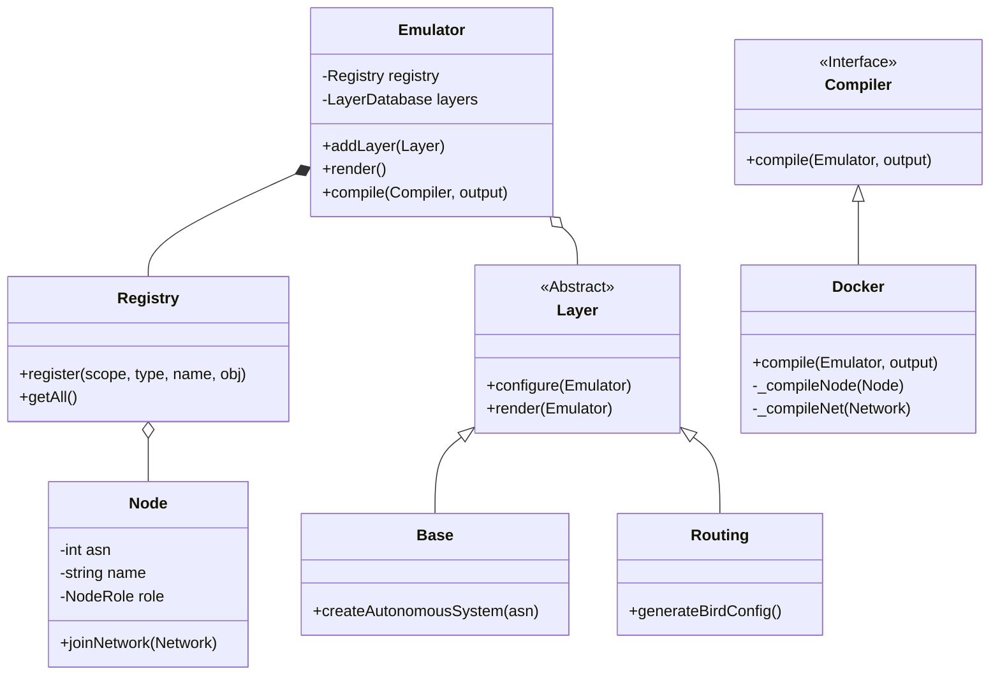
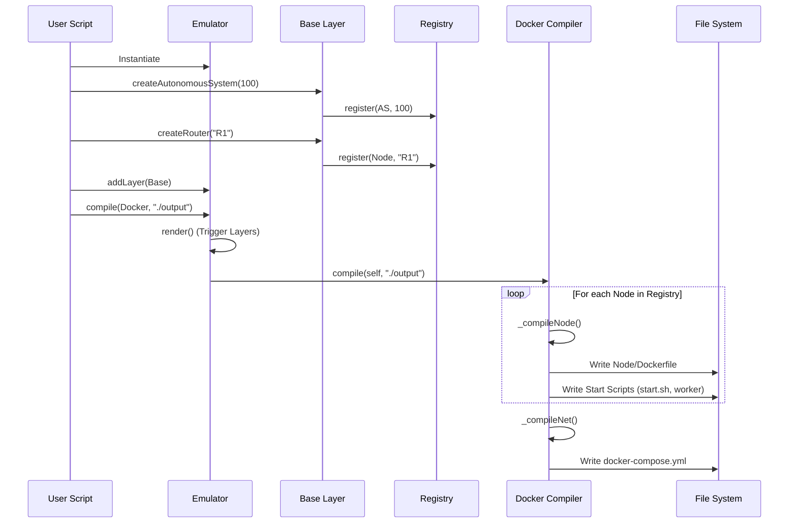
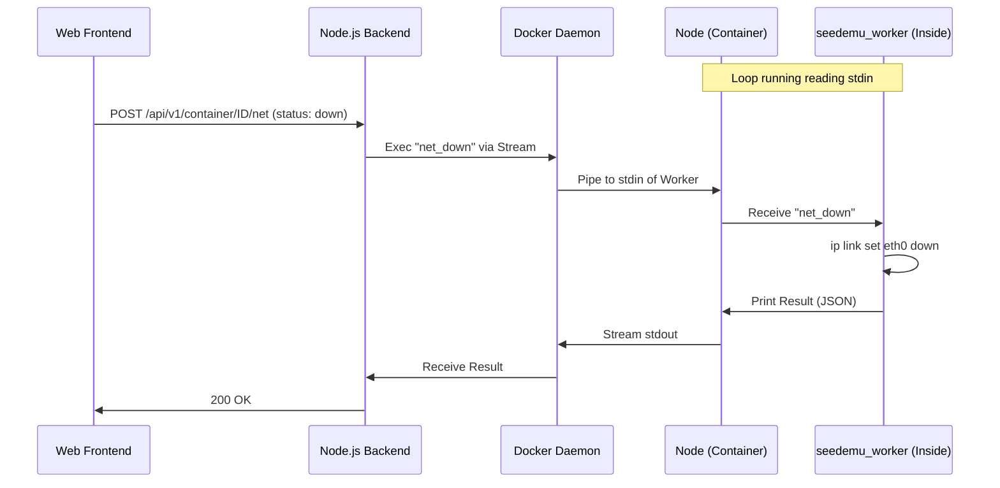

# SEED Emulator 深度架构解析

## 1. 项目全景图 (Project Map)

本项目是一个复杂的网络仿真器，它通过编排 Docker 容器来模拟复杂的互联网拓扑（如自治系统 AS、互联网交换点 IXP、BGP 路由）。

### 目录职责

*   **`seedemu/`**：核心 Python 包，包含仿真器逻辑。
    *   **`core/`**：定义基础抽象：`Emulator`（仿真器）、`Node`（节点）、`Network`（网络）、`Layer`（层）、`Binding`（绑定）。这是系统的“大脑”。
    *   **`layers/`**：以模块化层的形式实现特定的网络功能（例如，用于拓扑的 `Base`，用于 OSPF/BGP 配置的 `Routing`，`Ebgp`，`WebService`）。
    *   **`compiler/`**：处理将内部图表示转化为部署产物的过程。主要实现是 `Docker.py`。
    *   **`services/`**：定义可安装在节点上的高级服务（如 `WebService`）。
*   **`examples/`**：包含展示如何使用该库构建仿真的参考实现（例如 `simple_as.py`，`internet_emulator`）。
*   **`docker_images/`**：包含仿真节点使用的基础镜像的 `Dockerfile` 定义。
    *   **`seedemu-base`**：包含基本网络工具的公共祖先镜像。
    *   **`seedemu-router`**：在基础镜像之上扩展了路由守护进程（BIRD）。
*   **`client/`**：基于 Web 的可视化和控制界面。
    *   **`backend/`**：一个 Node.js (TypeScript) 守护进程，用于连接 Docker 引擎和 Web UI。
    *   **`frontend/`**：用于查看拓扑和状态的 Web 应用程序 (Webpack/React-like)。

### 核心入口点

用户交互主要通过 Python 脚本进行。
1.  **定义仿真**：用户编写 Python 脚本（例如 `examples/basic/A00_simple_as/simple_as.py`）。
2.  **实例化**：脚本实例化 `Emulator` 类。
3.  **构建拓扑**：用户通过 `Base` 层创建 `AutonomousSystem`（自治系统）、`Router`（路由器）和 `Network`（网络）对象。
4.  **编译**：用户调用 `emu.compile(Docker(), './output')`，触发生成 `docker-compose.yml` 和配置文件。
5.  **运行时**：用户在输出目录中运行 `docker-compose up`。

---

## 2. 构建与环境逻辑 (Build & Environment Logic)

### 打包与分发
*   **Python 包**：核心部分使用 `setup.py` 打包为 `seedemu`。它的运行时依赖极少（`requests`），主要依赖标准库进行逻辑处理，依赖 Docker 进行执行。
*   **Docker 镜像**：仿真器不会在每次运行时动态构建镜像（大部分情况下）。它依赖预构建的镜像以节省时间，但会为每个节点生成 `Dockerfile` 包装器以注入特定配置。

### Docker 镜像层级
仿真依赖于 `docker_images/` 中发现的分层 Docker 镜像架构：

1.  **基础层 (`ubuntu:20.04`)**：标准操作系统。
2.  **`seedemu-base`**：
    *   **派生自**：`ubuntu:20.04`。
    *   **工具**：`curl`, `dnsutils`, `iproute2` (ip), `tcpdump`, `netcat`, `zsh`。
    *   **用途**：为所有节点（主机和路由器）提供基础环境。
3.  **`seedemu-router`**：
    *   **派生自**：`seedemu-base`。
    *   **工具**：添加了 `bird2` (BIRD Internet Routing Daemon)。
    *   **用途**：专门用于充当路由器的节点，以处理 BGP/OSPF。

### Web 客户端构建
`client/` 目录包含一个多阶段构建的 `Dockerfile`。
*   **前端**：使用 `webpack` 构建。
*   **后端**：使用 `tsc` (TypeScript Compiler) 构建。
*   **运行时**：一个 Node.js 容器运行后端，并提供前端静态文件服务。

---

## 3. 核心执行流程 (Core Execution Flow)

### 从 Python 脚本到 Docker 容器

1.  **内存图构建**：
    *   用户与 `seedemu.layers.Base` 交互以创建 `AutonomousSystem`、`Router` 和 `Host` 等对象。
    *   这些对象被注册到 `Emulator` 的 `Registry`（注册表）中。
    *   `Emulator` 维护一个层列表 (`LayerDatabase`) 并编排它们。

2.  **渲染 (`Emulator.render`)**：
    *   在编译之前，调用 `render()` 方法。
    *   它遍历所有添加的层（Base, Routing, Ebgp 等）。
    *   每一层执行两遍：`configure()`（设置依赖）和 `render()`（完成配置，例如根据对等关系生成 BGP 配置文件）。

3.  **编译 (`Docker.compile`)**：
    `seedemu.compiler.Docker` 类负责繁重的工作。
    *   **目录生成**：它为仿真中的每个节点创建一个目录。
    *   **Dockerfile 生成**：它为每个节点生成自定义 `Dockerfile`。
        *   它选择合适的基础镜像（例如，如果角色是 Router，则选择 `seedemu-router`）。
        *   它复制生成的脚本：`start.sh`, `seedemu_worker`, `seedemu_sniffer`。
        *   它复制用户定义的文件和配置产物（如 Routing 层生成的 `bird.conf`）。
    *   **Docker Compose 生成**：它将所有节点和网络聚合到一个巨大的 `docker-compose.yml` 中。
        *   **网络**：它将内部 `Network` 对象映射到 Docker 网络（Bridge 驱动）。
        *   **元数据**：它大量使用 Docker `labels`（标签）来存储元数据（ASN、节点类型、显示名称）。Web UI 稍后会读取这些元数据。

### "自管理" 网络 ("Self-Managed" Networking)
一个关键的架构特性是支持“自管理网络”。Docker 默认的 IPAM 是僵化的。为了支持任意网络拓扑（如真实世界的 BGP 前缀）：
1.  编译器在 Docker 启动期间为容器分配“虚拟”IP（来自 `10.128.0.0/9`）。
2.  脚本 `replace_address.sh` 被注入到容器中。
3.  启动时（`start.sh`），此脚本运行 `ip addr del`（删除虚拟 IP）和 `ip addr add`（添加真实仿真 IP），从而有效地覆盖 Docker 的网络设置以匹配用户所需的拓扑。

---

## 4. 数据交互与通信 (Data Interaction & Communication)

### 前端 (Web UI) <-> 后端 (Daemon)
可视化工具遵循标准的客户端-服务器架构：
*   **协议**：HTTP (REST) 和 WebSockets。
*   **REST API**：诸如 `/api/v1/container` 和 `/api/v1/network` 的端点允许前端查询拓扑。
*   **发现**：后端使用 `dockerode` 库查询 Docker 守护进程。它解析 **Docker Labels**（在编译期间注入）以重建 UI 所需的拓扑结构。

### 后端 <-> 仿真节点
后端充当控制正在运行的仿真的桥梁。
*   **机制**：`docker exec`。后端不通过 TCP/IP 与节点的控制平面通信。相反，它直接在容器内部执行命令。
*   **`seedemu_worker`**：一个轻量级的 shell 脚本，在每个节点内无限循环运行。它从 `stdin` 读取并执行命令。
*   **控制逻辑 (`Controller.ts`)**：Node.js 后端通过 Docker 流附加到 `seedemu_worker` 进程。它发送诸如 `net_down`, `net_up`, 或 `bird_list_peer` 等命令，并解析 JSON 包装的输出。
*   **嗅探 (`Sniffer.ts`)**：后端附加到目标节点内的 `tcpdump` 进程 (`seedemu_sniffer`)，并通过 WebSockets 将数据包数据流式传输到前端以进行实时可视化。

### 节点 <-> 节点
*   **数据平面**：节点通过 Docker 创建的标准 Linux 网桥进行通信。在内部，这些使用 `veth` 对。
*   **控制平面 (路由)**：运行 `bird2` 的节点在这些链路上交换 BGP/OSPF 消息，就像真正的路由器一样。“网线”就是 Docker 网络。

---

## 5. 可视化架构 (Visual Architecture)

### 类图：仿真器核心

### 时序图：仿真生命周期

### 时序图：Web UI 控制流

