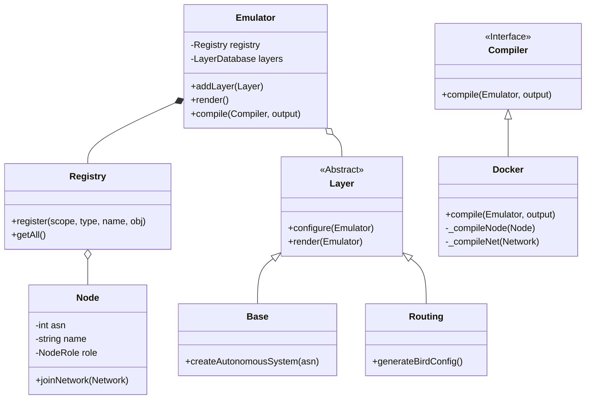
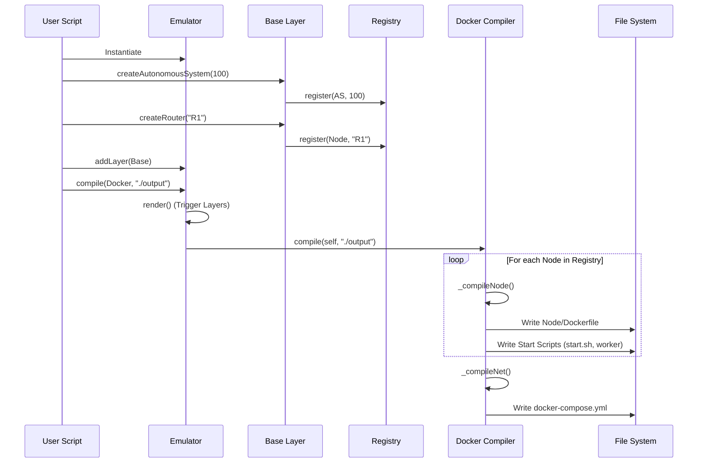
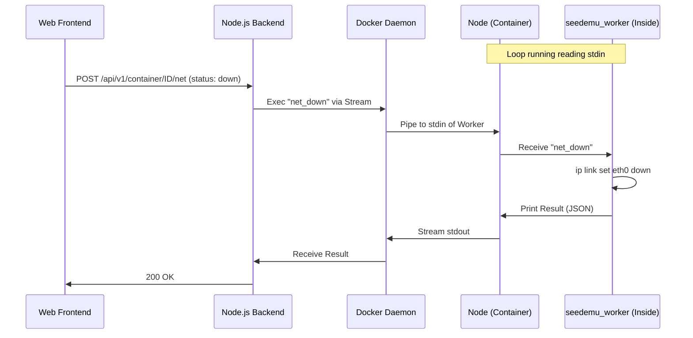

# SEED Emulator Architecture Deep Dive

## 1. Project Map (项目全景图)

This project is a sophisticated network emulator that orchestrates Docker containers to simulate complex Internet topologies (Autonomous Systems, IXPs, BGP routing).

### Directory Responsibilities

*   **`seedemu/`**: The core Python package containing the emulator logic.
    *   **`core/`**: Defines the fundamental abstractions: `Emulator`, `Node`, `Network`, `Layer`, `Binding`. This is the "brain" of the system.
    *   **`layers/`**: Implements specific network functionality as modular layers (e.g., `Base` for topology, `Routing` for OSPF/BGP configuration, `Ebgp`, `WebService`).
    *   **`compiler/`**: Handles the translation of the internal graph representation into deployment artifacts. The primary implementation is `Docker.py`.
    *   **`services/`**: Defines high-level services (like `WebService`) that can be installed on nodes.
*   **`examples/`**: Contains reference implementations showing how to use the library to build simulations (e.g., `simple_as.py`, `internet_emulator`).
*   **`docker_images/`**: Contains the `Dockerfile` definitions for the base images used by the emulator nodes.
    *   **`seedemu-base`**: The common ancestor with basic network tools.
    *   **`seedemu-router`**: Extends base with routing daemons (BIRD).
*   **`client/`**: The web-based visualization and control interface.
    *   **`backend/`**: A Node.js (TypeScript) daemon that interfaces with the Docker engine and the web UI.
    *   **`frontend/`**: The web application (Webpack/React-like) for viewing the topology and status.

### Core Entry Points

The user interaction primarily happens through Python scripts.
1.  **Simulation Definition**: Users write a Python script (e.g., `examples/basic/A00_simple_as/simple_as.py`).
2.  **Instantiation**: The script instantiates the `Emulator` class.
3.  **Topology Construction**: Users create `AutonomousSystem`, `Router`, and `Network` objects via the `Base` layer.
4.  **Compilation**: The user calls `emu.compile(Docker(), './output')`, which triggers the generation of `docker-compose.yml` and configuration files.
5.  **Runtime**: The user runs `docker-compose up` in the output directory.

---

## 2. Build & Environment Logic

### Packaging and Distribution
*   **Python Package**: The core is packaged as `seedemu` using `setup.py`. It has minimal runtime dependencies (`requests`), relying heavily on the standard library for logic and Docker for execution.
*   **Docker Images**: The emulator does not build images dynamically for every simulation run (mostly). It relies on pre-built images to save time, though it generates `Dockerfile` wrappers for each node to inject specific configurations.

### Docker Image Hierarchy
The simulation relies on a layered Docker image architecture found in `docker_images/`:

1.  **Base Layer (`ubuntu:20.04`)**: The standard OS.
2.  **`seedemu-base`**:
    *   **Derived from**: `ubuntu:20.04`.
    *   **Tools**: `curl`, `dnsutils`, `iproute2` (ip), `tcpdump`, `netcat`, `zsh`.
    *   **Purpose**: Provides the basic environment for all nodes (hosts and routers).
3.  **`seedemu-router`**:
    *   **Derived from**: `seedemu-base`.
    *   **Tools**: Adds `bird2` (The BIRD Internet Routing Daemon).
    *   **Purpose**: Used specifically for nodes acting as routers to handle BGP/OSPF.

### Web Client Build
The `client/` directory contains a multi-stage `Dockerfile`.
*   **Frontend**: Built with `webpack`.
*   **Backend**: Built with `tsc` (TypeScript Compiler).
*   **Runtime**: A Node.js container runs the backend, serving the frontend static files.

---

## 3. Core Execution Flow

### From Python Script to Docker Containers

1.  **In-Memory Graph Construction**:
    *   The user interacts with `seedemu.layers.Base` to create objects like `AutonomousSystem`, `Router`, and `Host`.
    *   These objects are registered in the `Emulator`'s `Registry`.
    *   The `Emulator` maintains a list of layers (`LayerDatabase`) and orchestrates them.

2.  **Rendering (`Emulator.render`)**:
    *   Before compilation, the `render()` method is called.
    *   It iterates through all added layers (Base, Routing, Ebgp, etc.).
    *   Each layer performs two passes: `configure()` (setup dependencies) and `render()` (finalize configuration, e.g., generating BGP config files based on peering relationships).

3.  **Compilation (`Docker.compile`)**:
    The `seedemu.compiler.Docker` class is responsible for the heavy lifting.
    *   **Directory Generation**: It creates a directory for every node in the simulation.
    *   **Dockerfile Generation**: For each node, it generates a custom `Dockerfile`.
        *   It selects the appropriate base image (e.g., `seedemu-router` if role is Router).
        *   It copies generated scripts: `start.sh`, `seedemu_worker`, `seedemu_sniffer`.
        *   It copies user-defined files and configuration artifacts (like `bird.conf` generated by the Routing layer).
    *   **Docker Compose Generation**: It aggregates all nodes and networks into a massive `docker-compose.yml`.
        *   **Networks**: It maps internal `Network` objects to Docker networks (Bridge driver).
        *   **Metadata**: It heavily uses Docker `labels` to store metadata (ASN, Node Type, Display Name). This metadata is later read by the Web UI.

### "Self-Managed" Networking
A key architectural feature is the support for "Self-Managed Networks". Docker's default IPAM is rigid. To support arbitrary network topologies (like real-world BGP prefixes):
1.  The compiler assigns "dummy" IPs (from `10.128.0.0/9`) to containers during Docker startup.
2.  A script `replace_address.sh` is injected into the container.
3.  Upon startup (`start.sh`), this script runs `ip addr del` (dummy IP) and `ip addr add` (real simulation IP), effectively overriding Docker's networking to match the user's desired topology.

---

## 4. Data Interaction & Communication

### Frontend (Web UI) <-> Backend (Daemon)
The architecture follows a standard Client-Server model for the visualization tool:
*   **Protocol**: HTTP (REST) and WebSockets.
*   **REST API**: Endpoints like `/api/v1/container` and `/api/v1/network` allow the frontend to query the topology.
*   **Discovery**: The backend uses the `dockerode` library to query the Docker Daemon. It parses the **Docker Labels** (injected during compilation) to reconstruct the topology for the UI.

### Backend <-> Simulation Nodes
The Backend acts as a bridge to control the running simulation.
*   **Mechanism**: `docker exec`. The backend does not communicate via TCP/IP with the nodes' control plane. Instead, it executes commands directly inside the container.
*   **`seedemu_worker`**: A lightweight shell script running in an infinite loop inside every node. It reads from `stdin` and executes commands.
*   **Control Logic (`Controller.ts`)**: The Node.js backend attaches to the `seedemu_worker` process via Docker streams. It sends commands like `net_down`, `net_up`, or `bird_list_peer` and parses the JSON-wrapped output.
*   **Sniffing (`Sniffer.ts`)**: The backend attaches to a `tcpdump` process (`seedemu_sniffer`) inside the target node and streams the packet data via WebSockets to the frontend for live visualization.

### Node <-> Node
*   **Data Plane**: Nodes communicate via standard Linux Bridges created by Docker. Internally, these use `veth` pairs.
*   **Control Plane (Routing)**: Nodes running `bird2` exchange BGP/OSPF messages over these links just like real routers. The "wire" is the Docker network.

---

## 5. Visual Architecture

### Class Diagram: Emulator Core

### Sequence Diagram: Simulation Lifecycle

### Sequence Diagram: Web UI Control Flow

