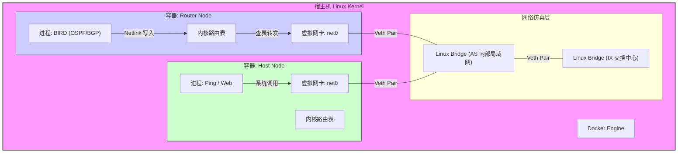
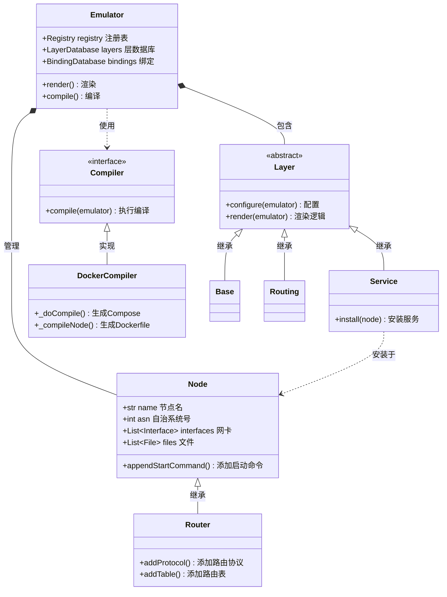
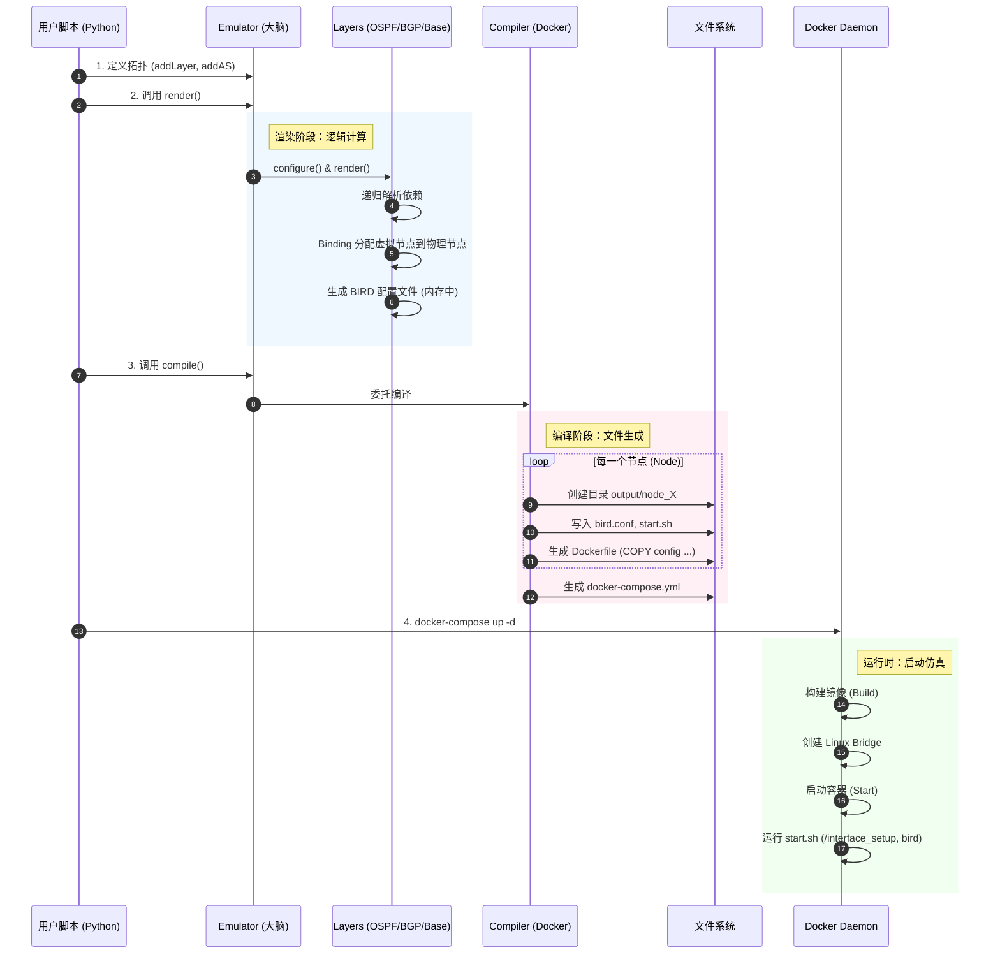

# SEED Emulator 技术白皮书：底层原理与功能深度解析

## 1. 核心原理：基于 Linux 命名空间的网络虚拟化

SEED Emulator 的本质并非简单的“Docker 启动器”，而是一个**基于 Linux 内核特性的轻量级网络仿真器**。它利用 Docker 容器作为载体，通过 Linux Namespace（命名空间）技术实现了网络协议栈的隔离与模拟。

### 1.1 为什么它能模拟互联网？(The "Why")

SEED Emulator 能够在单机上模拟拥有数百个路由器和自治系统（AS）的互联网，其核心依赖于以下 Linux 技术：

*   **Network Namespace (网络命名空间)**:
    *   **原理**: 每一个 Docker 容器都拥有自己独立的 Network Namespace。这意味着每个容器都有独立的网卡（Interface）、路由表（Routing Table）、ARP 缓存和 iptables 规则。
    *   **在本项目中**: 每一个模拟节点（Node），无论是主机（Host）还是路由器（Router），本质上都是一个独立的 Network Namespace。这使得它们感觉自己是一台独立的物理机。

*   **Veth Pair (虚拟网线)**:
    *   **原理**: 既然有了隔离的 Namespace，怎么把它们连起来？Linux 提供了 `veth pair`，它像一根虚拟网线，一头插在容器 A 里，一头插在 Linux Bridge（虚拟交换机）上。
    *   **在本项目中**: `Base` 层会根据拓扑图，指挥 Docker 创建这些虚拟连线。

*   **Linux Bridge (虚拟交换机)**:
    *   **原理**: Linux Bridge 工作在数据链路层（L2）。
    *   **在本项目中**: 每一个模拟的局域网（LAN）或互联网交换中心（IX），在宿主机上都对应一个 Linux Bridge。连接到同一个 Bridge 的容器，就像连接到同一个交换机的电脑，可以直接二层通信。

*   **BIRD (用户态路由守护进程)**:
    *   **原理**: Linux 内核自带路由功能，但不支持 BGP/OSPF 等动态路由协议。
    *   **在本项目中**: SEED Emulator 在充当路由器的容器里运行 **BIRD** 软件。BIRD 监听网络端口（如 TCP 179 for BGP），根据协议计算出路由路径，然后通过 **Netlink 接口** 直接修改容器内核的路由表。
    *   **效果**: 当你在容器里 `ping` 一个 IP 时，Linux 内核查路由表，而这个表是 BIRD 刚刚“写”进去的。这就完美模拟了真实路由器的行为。

### 1.2 运行时架构原理图 (Runtime Architecture)



### 1.3 代码结构与类关系 (Code Structure & Class Diagram)

为了实现上述功能，项目代码采用了经典的面向对象设计。

*   **大脑 (The Brain):** `seedemu/core/`
    *   `Emulator.py`: 总指挥。负责管理所有的层（Layers）和节点（Nodes），并调度渲染流程。
    *   `Node.py`: 容器的抽象表示。它不直接操作 Docker，而是存储“我需要运行什么命令”、“我有哪些文件”等元数据。
    *   `Layer.py`: 功能模块的基类。比如 `Ospf` 层负责给节点添加 OSPF 配置，`Base` 层负责创建基础网络。

*   **四肢 (The Limbs):** `seedemu/compiler/`
    *   `Docker.py`: 这是将 Python 对象转化为现实的关键。它读取 `Emulator` 中的数据，生成 `docker-compose.yml`、`Dockerfile` 和启动脚本。



### 1.4 数据包漫游指南 (A Packet's Journey)

为了深入理解这套机制，我们跟踪一个 ICMP Echo Request 数据包，假设它从 **主机 A** 发往 **主机 B**（跨 AS）：

1.  **起点 (Host A Container)**:
    *   用户执行 `ping B_IP`。
    *   内核查询路由表：`ip route show`。发现目标不在本地子网，匹配到默认网关（Default Gateway）。
    *   ARP 请求：谁是网关 IP 的 MAC？
    *   数据包封装：`[Ethernet Dst=GatewayMAC | IP Src=A_IP Dst=B_IP | ICMP]`。
    *   **出站**: 数据包通过 `veth` 接口离开 Host A 的 Network Namespace。

2.  **传输 (Linux Bridge)**:
    *   数据包到达宿主机的 `br-xxxx` 网桥。
    *   网桥根据目标 MAC 地址查找转发表（FDB），将数据包转发到连接网关路由器的 `veth` 端口。

3.  **网关 (Router Container)**:
    *   数据包进入路由器的 Network Namespace。
    *   内核解包，发现 MAC 是给自己的，提交给 IP 层。
    *   IP 层查路由表。**关键点**：这个路由表是由 BIRD 写入的。BIRD 通过 BGP 协议学习到了 `B_IP` 属于哪个 AS，下一跳是谁。
    *   内核重新封装数据包（修改 MAC 地址为下一跳路由器），再次发回网桥（或另一个网桥）。

4.  **终点 (Host B Container)**:
    *   经过若干跳路由器后，数据包到达 Host B 所在的子网路由器。
    *   路由器 ARP 广播找到 Host B。
    *   数据包送达 Host B，内核回复 ICMP Echo Reply。

---

## 2. 功能模块详解：网络层面的“积木”

SEED Emulator 采用“分层（Layer）”设计。每一层都在底层的 Linux 网络设施上叠加新的功能。

### 2.1 物理层模拟 (Base Layer) 与 智能 IP 分配
这是地基。它负责“拉网线”和“分号码”。
*   **功能**: 定义自治系统（AS）、路由器、主机和它们之间的物理连接。
*   **智能 IP 分配 (AddressAssignmentConstraint)**:
    *   Emulator 并不是随机分配 IP 的，而是遵循一套严格的规则（详见 `seedemu/core/AddressAssignmentConstraint.py`）。
    *   **主机 (Hosts)**: 默认从网络前缀的 `.71` 开始分配，直到 `.99`。
    *   **路由器 (Routers)**: 默认从 `.254` 倒序分配到 `.200`。
    *   **IX 对等互联 (Peering)**: IP 直接映射自 ASN（例如 AS10 在 IX 上的 IP 就是 `.10`），这极大简化了 BGP 配置的调试。
*   **实现**: 生成 Docker Compose 的 `networks` 定义。每个 Network 对应一个 Linux Bridge。
*   **关键脚本**: `/interface_setup`。它运行在容器启动时，负责把 Docker 默认分配的 `eth0` 等重命名为 `net0`。

### 2.2 路由层 (Routing Layer)
这是神经系统。它让路由器“变聪明”。
*   **功能**: 为所有路由器安装 BIRD 软件，并开启 Kernel 协议（让 BIRD 能读写内核路由表）。
*   **Loopback 机制**: 自动为每个路由器分配一个 Loopback IP（如 `10.0.0.1/32`）。这是 BGP Peering 的基石，因为物理接口可能会断，但只要路由器还在，Loopback 地址就永远可达。

### 2.3 内部网关协议 (OSPF Layer)
*   **功能**: 解决 AS 内部的连通性。
*   **原理**:
    *   它自动扫描一个 AS 内的所有路由器接口。
    *   它会生成 BIRD 配置，将这些接口加入 OSPF Area 0。
    *   **效果**: AS 内的路由器自动互相学习路由。路由器 A 知道怎么去路由器 B 的 Loopback 地址。

### 2.4 边界网关协议 (Ebgp / Ibgp Layer)
这是互联网的核心。
*   **IBGP (Interior BGP)**:
    *   **功能**: 在 AS **内部**的路由器之间同步外部路由。
    *   **实现**: 自动建立“全互联（Full Mesh）”连接。Emulator 遍历图结构，让 AS 内每两台路由器之间都配置 iBGP。
*   **EBGP (Exterior BGP)**:
    *   **功能**: 在**不同 AS** 之间交换路由。
    *   **实现**: 见 `seedemu/layers/Ebgp.py`。
    *   **社区属性 (Communities)**: 为了模拟真实的商业互联关系（Provider/Customer/Peer），Emulator 使用了 BGP Communities 标记路由。
        *   `LOCAL_COMM`: 本地路由。
        *   `CUSTOMER_COMM`: 来自客户的路由（可以转卖给所有人）。
        *   `PEER_COMM`: 来自对等体的路由（只能传给客户，不能传给其他对等体或上游）。
        *   这通过 BIRD 的 `import filter` 和 `export filter` 模板自动生成。

### 2.5 互联网交换中心 (Internet Exchange - IX)
*   **功能**: 模拟真实世界的 IXP（如 HKIX, AMS-IX）。
*   **原理**: IX 本质上是一个巨大的 Layer 2 交换机（Linux Bridge）。连接到 IX 的路由器会获得一个 IX 网段的 IP。
*   **Route Server (路由服务器)**: 一种特殊的 BGP 路由器，它不转发数据流量，只负责分发路由表，简化了多方 Peering 的配置。

### 2.6 应用服务层与节点绑定 (Service Layer & Binding)
除了网络，还能模拟应用。
*   **虚拟节点与物理节点 (Virtual vs Physical)**:
    *   Service（如 WebService）通常是定义在“虚拟节点”（Virtual Node）上的。
    *   **绑定机制 (Binding)**: `Emulator` 在渲染时，会查询 `BindingDatabase`。它根据正则表达式（例如 `Action.RANDOM` 或 `Action.NEW`）将虚拟的服务自动“调度”到某个物理的 Host 节点上运行。

### 2.7 域名服务 (DNS) 实现机制
`DomainNameService.py` 是一个典型的配置生成器。
*   **Zone 对象**: 在内存中维护 DNS 记录（A, NS, SOA）。
*   **自动化**: 当你把一个 Host 加入网络时，DNS 层会自动收集它的 IP，并在 Zone 对象中添加 A 记录。
*   **落地**: `install()` 方法将内存中的 Zone 对象序列化为 BIND9 的标准 Zone 文件格式（如 `/etc/bind/zones/example.com`），并生成 `named.conf.zones` 配置文件。

### 2.8 Web 服务与 Nginx 模板
`WebService.py` 使用模板注入技术。
*   **模板**: 定义了标准的 Nginx `server` 块。
*   **变量替换**: 用 `{serverName}` 和 `{port}` 替换模板中的占位符。
*   **SSL/TLS**: 如果启用了 HTTPS，它甚至会自动请求 CA 服务生成证书，并配置 Nginx 的 `ssl_certificate` 指令。

---

## 3. 代码级实现细节审计

针对工程实现的深度剖析。

### 3.1 Docker Client 初始化：谁在通过 API 说话？

**误区澄清**: SEED Emulator 的**核心编译器（Compiler）**并不直接调用 Docker API 来启动容器。它是一个“配置生成器”。

*   **核心逻辑**: Python 代码生成静态的 `docker-compose.yml` 文件。
*   **用户操作**: 用户在 Shell 中运行 `docker-compose up`，此时由 Docker Compose 工具去调用 Docker Engine API。

**例外情况**: 以下组件会直接调用 Docker API（使用 `docker.from_env()`）：
1.  **自动化测试框架** (`tests/`): 需要动态启动/销毁环境进行测试。
2.  **可视化工具** (`EtherView`): 需要实时读取容器状态来画图。

### 3.2 网络命令生成：字符串拼接的艺术

Emulator 如何控制底层网络？答案是：**模板注入**。

以 **EVPN (VXLAN)** 功能为例，Python 代码直接拼接了 Linux 原生命令。
*   **文件**: `seedemu/layers/Evpn.py`
*   **逻辑**: 定义了一个 Shell 脚本模板，包含 `ip link add` 命令。

```python
# seedemu/layers/Evpn.py 源码片段
EvpnFileTemplates['vetp_bridge'] = '''\
auto br-{name}
iface br-{name} inet manual
    # 创建网桥
    pre-up          ip link add br-{name} type bridge stp_state 0
    post-down       ip link del br-{name}

auto vtep-{name}
iface vtep-{name} inet manual
    # 创建 VXLAN 接口，指定 VNI 和组播端口
    pre-up          ip link add vtep-{name} type vxlan id {vni} dstport 4789 local {loopbackAddress}
    # 将 VXLAN 接口插到网桥上
    pre-up          ip link set vtep-{name} master br-{name}
'''
```
这个字符串被填充变量后，写入容器的 `/etc/network/interfaces.d/`。当容器启动，Linux 的网络管理器执行这些命令，从而在内核中创建出 VXLAN 隧道。

### 3.3 渲染引擎：递归依赖解析 (Dependency & Rendering)

为什么 `Base` 层总是在 `Routing` 层之前执行？这不是巧合，而是设计。

*   **文件**: `seedemu/core/Emulator.py`
*   **方法**: `__render(layerName)`
*   **逻辑**:
    Emulator 维护了一个依赖图。`__render` 方法是一个递归函数：
    1.  检查当前层是否已渲染（`done` 标记）。
    2.  读取 `dependencies_db`，找到当前层依赖的所有前置层。
    3.  **递归调用** `__render` 先去渲染那些前置层。
    4.  前置层完成后，执行当前层的 `configure()` 和 `render()`。

### 3.4 镜像构建审计 (Dockerfile Audit)

协议栈是如何被“烧录”进镜像的？我们审计 `docker_images/seedemu-router/Dockerfile`。

1.  **基础镜像**: `FROM handsonsecurity/seedemu-base`
2.  **路由软件**: `RUN apt-get install bird2`
3.  **配置文件注入 (Runtime Injection)**:
    真正的 `bird.conf` 并不是在镜像构建时确定的，而是在**编译器运行时**生成的。`Docker.py` 为每个节点生成专属的 `Dockerfile`，其中包含 `COPY bird.conf /etc/bird/bird.conf`。这意味着所有路由器共用同一个镜像，但拥有独一无二的配置。

### 3.5 扩展性设计：如何自定义组件

SEED Emulator 的架构允许用户通过继承核心类来扩展功能。

*   **自定义 Layer**: 继承 `Layer` 类。
    *   实现 `getName()` 返回唯一标识。
    *   实现 `render(emulator)` 注入自定义逻辑（例如，给所有节点添加一个新的监控脚本）。
    *   使用 `addDependency()` 确保在基础层之后运行。
*   **自定义 Compiler**: 继承 `Compiler` 类。
    *   目前主要是 `Docker` 编译器，但理论上可以编写 `KubernetesCompiler`，将 `_compileNode` 的输出适配为 Pod 定义。

---

## 4. 实战交互时序图 (Execution Flow)

从用户写代码到网络跑起来，发生了什么？



---

## 5. 真实性深度问答 (Authenticity Q&A)

针对“为什么这个仿真器能模拟真实网络”的核心疑问，我们进行深度解答。

### Q1: SEED Emulator 是“仿真 (Emulation)”还是“模拟 (Simulation)”？区别在哪？
**A:** 这是一个**仿真器 (Emulator)**。
*   **模拟器 (Simulator)**（如 ns-3）是用数学模型来近似网络的行为。它只是一个运行在单一进程中的程序，不运行真实的操作系统内核，也不运行真实的协议栈代码。
*   **仿真器 (Emulator)**（如 SEED Emulator）运行真实的软件。当你在 SEED Emulator 的节点上运行 `ping` 时，执行的是真实的 Linux `iputils-ping` 二进制文件，数据包经过的是真实的 Linux 内核 TCP/IP 协议栈，路由决策是由真实的 `bird2` 守护进程做出的。
*   **结论**: 除非你研究的是物理层信号衰减，否则 SEED Emulator 的行为与真实网络**完全一致**。

### Q2: 为什么我能在模拟器里访问 `google.com`？它是真的连到了互联网吗？
**A:** 不一定。这是通过 **DNS 劫持 (DNS Shadowing)** 技术实现的。
*   **机制**: `DomainNameService` 会在模拟器内部启动一个“根域名服务器 (Root Zone)”。
*   **操作**: 当你定义了一个 Web 服务并将其绑定到 `google.com` 时，模拟器会在内部的根 DNS 中添加一条 A 记录，指向内部的一个容器 IP（比如 `10.100.0.5`）。
*   **效果**: 容器内的客户端查询 `google.com` 时，会得到内部 IP，并访问内部的 Nginx 服务器。这模拟了真实网站，但流量并未流出宿主机。
*   **真实连接**: 如果启用了 `RealWorldRouter` 模块，容器确实可以通过 NAT 访问外部真实的互联网。

### Q3: 这里的 Web 服务器和真实互联网上的有区别吗？
**A:** **没有区别**。
*   SEED Emulator 启动的 Web 服务器容器里运行的是标准的 **Nginx** 或 **Apache** 软件。
*   它加载的配置文件（`nginx.conf`）与你在生产环境中使用的语法完全一致。
*   你可以随时通过 `docker exec` 进入容器，查看日志、修改配置，甚至安装 PHP/Python 后端。它就是一个标准的 Linux 服务器环境。

### Q4: 路由协议是模拟的算法，还是真实的协议交互？
**A:** 是**完全真实的协议交互**。
*   路由器节点运行的是 **BIRD Internet Routing Daemon**。这是许多真实互联网交换中心（IXP）和 ISP 正在使用的工业级路由软件。
*   路由器之间通过 TCP 179 端口建立 BGP 会话，交换 Update 报文。
*   如果你用 Wireshark 抓包，你会看到标准的 BGP/OSPF 数据包格式，甚至可以与 Cisco/Juniper 的路由器进行互操作。

### Q5: 我能在这些节点上运行黑客工具（如 nmap, wireshark）吗？
**A:** **完全可以**。
*   这正是 SEED Emulator 设计的初衷（用于安全教育）。
*   由于每个节点都是一个 Linux 容器，你可以安装任何 Linux 兼容的工具。
*   你可以从一个 Host 节点对另一个 Router 节点发起 SYN Flood 攻击，或者进行端口扫描。因为协议栈是真实的，受害节点的内核会产生真实的响应（如 TCP Backlog 溢出）。
