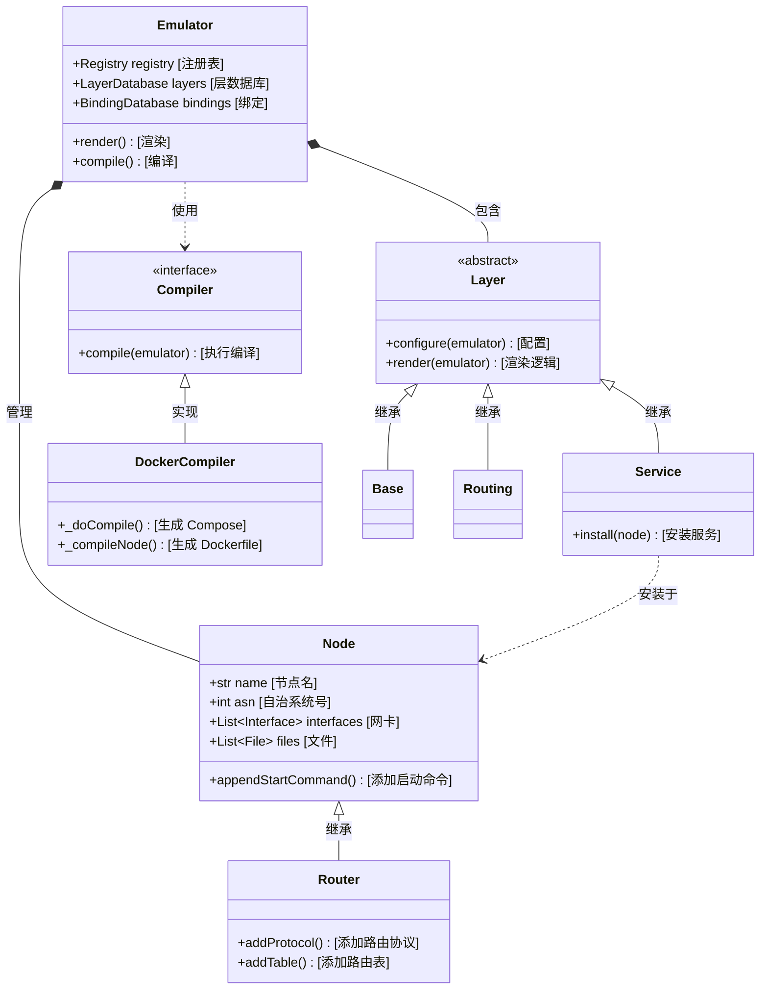
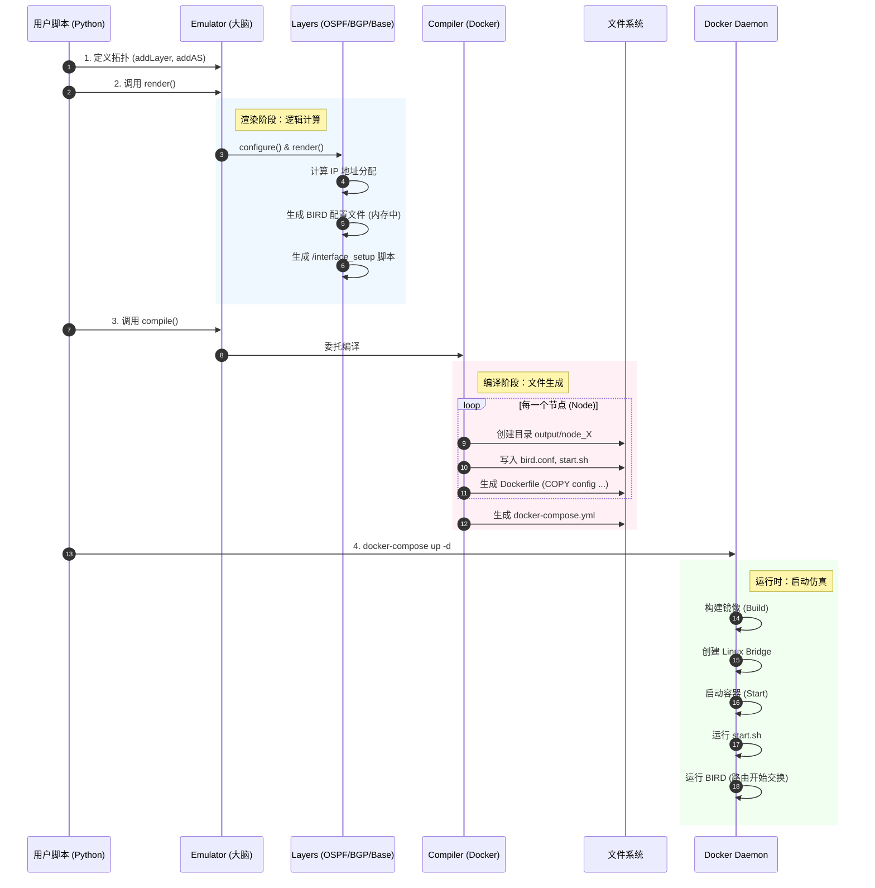

# SEED Emulator 技术白皮书：底层原理与功能深度解析

## 1. 核心原理：基于 Linux 命名空间的网络虚拟化

SEED Emulator 的本质并非简单的“Docker 启动器”，而是一个**基于 Linux 内核特性的轻量级网络仿真器**。它利用 Docker 容器作为载体，通过 Linux Namespace（命名空间）技术实现了网络协议栈的隔离与模拟。

### 1.1 为什么它能模拟互联网？(The "Why")

SEED Emulator 能够在单机上模拟拥有数百个路由器和自治系统（AS）的互联网，其核心依赖于以下 Linux 技术：

*   **Network Namespace (网络命名空间)**:
    *   **原理**: 每一个 Docker 容器都拥有自己独立的 Network Namespace。这意味着每个容器都有独立的网卡（Interface）、路由表（Routing Table）、ARP 缓存和 iptables 规则。
    *   **在本项目中**: 每一个模拟节点（Node），无论是主机（Host）还是路由器（Router），本质上都是一个独立的 Network Namespace。这使得它们感觉自己是一台独立的物理机。

*   **Veth Pair (虚拟网线)**:
    *   **原理**: 既然有了隔离的 Namespace，怎么把它们连起来？Linux 提供了 `veth pair`，它像一根虚拟网线，一头插在容器 A 里，一头插在 Linux Bridge（虚拟交换机）上。
    *   **在本项目中**: `Base` 层会根据拓扑图，指挥 Docker 创建这些虚拟连线。

*   **Linux Bridge (虚拟交换机)**:
    *   **原理**: Linux Bridge 工作在数据链路层（L2）。
    *   **在本项目中**: 每一个模拟的局域网（LAN）或互联网交换中心（IX），在宿主机上都对应一个 Linux Bridge。连接到同一个 Bridge 的容器，就像连接到同一个交换机的电脑，可以直接二层通信。

*   **BIRD (用户态路由守护进程)**:
    *   **原理**: Linux 内核自带路由功能，但不支持 BGP/OSPF 等动态路由协议。
    *   **在本项目中**: SEED Emulator 在充当路由器的容器里运行 **BIRD** 软件。BIRD 监听网络端口（如 TCP 179 for BGP），根据协议计算出路由路径，然后通过 **Netlink 接口** 直接修改容器内核的路由表。
    *   **效果**: 当你在容器里 `ping` 一个 IP 时，Linux 内核查路由表，而这个表是 BIRD 刚刚“写”进去的。这就完美模拟了真实路由器的行为。

### 1.2 运行时架构原理图 (Runtime Architecture)

```mermaid
graph TD
    subgraph Host_Machine [宿主机 Linux Kernel]
        DockerEngine[Docker Engine]

        subgraph Network_Simulation [网络仿真层]
            Bridge_IX[Linux Bridge (IX 交换中心)]
            Bridge_LAN[Linux Bridge (AS 内部局域网)]
        end

        subgraph Container_Router [容器: Router Node]
            Process_BIRD[进程: BIRD (OSPF/BGP)]
            Kernel_RT[内核路由表]
            Veth_R[虚拟网卡: net0]

            Process_BIRD -->|Netlink 写入| Kernel_RT
            Kernel_RT -->|查表转发| Veth_R
        end

        subgraph Container_Host [容器: Host Node]
            Process_Ping[进程: Ping / Web]
            Kernel_RT_H[内核路由表]
            Veth_H[虚拟网卡: net0]

            Process_Ping -->|系统调用| Veth_H
        end

        Veth_R ---|Veth Pair| Bridge_LAN
        Veth_H ---|Veth Pair| Bridge_LAN
        Bridge_LAN ---|Veth Pair| Bridge_IX
    end

    style Host_Machine fill:#f9f,stroke:#333,stroke-width:2px
    style Container_Router fill:#ccf,stroke:#333
    style Container_Host fill:#cfc,stroke:#333
```

### 1.3 代码结构与类关系 (Code Structure & Class Diagram)

为了实现上述功能，项目代码采用了经典的面向对象设计。

*   **大脑 (The Brain):** `seedemu/core/`
    *   `Emulator.py`: 总指挥。负责管理所有的层（Layers）和节点（Nodes），并调度渲染流程。
    *   `Node.py`: 容器的抽象表示。它不直接操作 Docker，而是存储“我需要运行什么命令”、“我有哪些文件”等元数据。
    *   `Layer.py`: 功能模块的基类。比如 `Ospf` 层负责给节点添加 OSPF 配置，`Base` 层负责创建基础网络。

*   **四肢 (The Limbs):** `seedemu/compiler/`
    *   `Docker.py`: 这是将 Python 对象转化为现实的关键。它读取 `Emulator` 中的数据，生成 `docker-compose.yml`、`Dockerfile` 和启动脚本。



---

## 2. 功能模块详解：网络层面的“积木”

SEED Emulator 采用“分层（Layer）”设计。每一层都在底层的 Linux 网络设施上叠加新的功能。

### 2.1 物理层模拟 (Base Layer)
这是地基。它负责“拉网线”。
*   **功能**: 定义自治系统（AS）、路由器、主机和它们之间的物理连接。
*   **实现**: 生成 Docker Compose 的 `networks` 定义。每个 Network 对应一个 Linux Bridge。如果两个节点都在同一个 Network 里，Docker 就会把它们的 veth pair 插到同一个 Bridge 上。
*   **关键脚本**: `/interface_setup`。它运行在容器启动时，负责把 Docker 默认分配的 `eth0`, `eth1` 重命名为更有意义的 `net0` (连接内部网络) 或 `net1` (连接 IX)。

### 2.2 路由层 (Routing Layer)
这是神经系统。它让路由器“变聪明”。
*   **功能**: 为所有路由器安装 BIRD 软件，并开启 Kernel 协议（让 BIRD 能读写内核路由表）和 Device 协议（让 BIRD 能感知网卡状态）。
*   **Loopback 机制**: 自动为每个路由器分配一个 Loopback IP（如 `10.0.0.1/32`）。这是 BGP Peering 的基石，因为物理接口可能会断，但只要路由器还在，Loopback 地址就永远可达。

### 2.3 内部网关协议 (OSPF Layer)
*   **功能**: 解决 AS 内部的连通性。
*   **原理**:
    *   它自动扫描一个 AS 内的所有路由器接口。
    *   它会生成 BIRD 配置，将这些接口加入 OSPF Area 0。
    *   **效果**: AS 内的路由器自动互相学习路由。路由器 A 知道怎么去路由器 B 的 Loopback 地址，这为建立 iBGP 打好了基础。

### 2.4 边界网关协议 (Ebgp / Ibgp Layer)
这是互联网的核心。
*   **IBGP (Interior BGP)**:
    *   **功能**: 在 AS **内部**的路由器之间同步外部路由。
    *   **实现**: 自动建立“全互联（Full Mesh）”连接。Emulator 会遍历图结构，让 AS 内每两台路由器之间都配置一条 iBGP 会话。
*   **EBGP (Exterior BGP)**:
    *   **功能**: 在**不同 AS** 之间交换路由。
    *   **实现**: 当你在 Python 里写 `as1.peering(as2)` 时，Emulator 会找到这两个 AS 的边界路由器，在它们的 BIRD 配置里添加 `neighbor <对方IP> as <对方ASN>`。

### 2.5 互联网交换中心 (Internet Exchange - IX)
*   **功能**: 模拟真实世界的 IXP（如 HKIX, AMS-IX）。
*   **原理**:
    *   IX 本质上是一个巨大的 Layer 2 交换机（Linux Bridge）。
    *   连接到 IX 的路由器会获得一个 IX 网段的 IP。
    *   **Route Server (路由服务器)**: Emulator 甚至支持模拟 RS。这是一种特殊的 BGP 路由器，它不转发数据流量，只负责分发路由表，简化了多方 Peering 的配置。

### 2.6 应用服务层 (Service Layer)
除了网络，还能模拟应用。
*   **Web Service**: 启动 nginx/apache 容器。
*   **DNS Service**: 启动 Bind9。Emulator 会自动生成 Zone 文件，把模拟网络中的域名解析到对应的内网 IP。
*   **Botnet (僵尸网络)**: 模拟 C&C 服务器和僵尸节点，用于安全研究。
*   **BGP Looking Glass**: 一个 Web 界面，允许用户查询某个路由器的 BIRD 状态（`show route`），用于调试网络。

---

## 3. 代码级实现细节审计

针对工程实现的深度剖析。

### 3.1 Docker Client 初始化：谁在通过 API 说话？

**误区澄清**: SEED Emulator 的**核心编译器（Compiler）**并不直接调用 Docker API 来启动容器。它是一个“配置生成器”。

*   **核心逻辑**: Python 代码生成静态的 `docker-compose.yml` 文件。
*   **用户操作**: 用户在 Shell 中运行 `docker-compose up`，此时由 Docker Compose 工具去调用 Docker Engine API。

**例外情况**: 以下组件会直接调用 Docker API（使用 `docker.from_env()`）：
1.  **自动化测试框架** (`tests/`): 需要动态启动/销毁环境进行测试。
2.  **可视化工具** (`EtherView`): 需要实时读取容器状态来画图。

### 3.2 网络命令生成：字符串拼接的艺术

Emulator 如何控制底层网络？答案是：**模板注入**。

以 **EVPN (VXLAN)** 功能为例，Python 代码直接拼接了 Linux 原生命令。
*   **文件**: `seedemu/layers/Evpn.py`
*   **逻辑**: 定义了一个 Shell 脚本模板，包含 `ip link add` 命令。

```python
# seedemu/layers/Evpn.py 源码片段
EvpnFileTemplates['vetp_bridge'] = '''\
auto br-{name}
iface br-{name} inet manual
    # 创建网桥
    pre-up          ip link add br-{name} type bridge stp_state 0
    post-down       ip link del br-{name}

auto vtep-{name}
iface vtep-{name} inet manual
    # 创建 VXLAN 接口，指定 VNI 和组播端口
    pre-up          ip link add vtep-{name} type vxlan id {vni} dstport 4789 local {loopbackAddress}
    # 将 VXLAN 接口插到网桥上
    pre-up          ip link set vtep-{name} master br-{name}
'''
```
这个字符串被填充变量后，写入容器的 `/etc/network/interfaces.d/`。当容器启动，Linux 的网络管理器执行这些命令，从而在内核中创建出 VXLAN 隧道。

### 3.3 拓扑遍历：从对象到 YAML

编译器如何把 Python 对象变成 Docker Service？
*   **文件**: `seedemu/compiler/Docker.py`
*   **位置**: `_doCompile` 方法（约第 1300 行）。

```python
    def _doCompile(self, emulator: Emulator):
        # 1. 遍历注册表 (Registry)
        registry = emulator.getRegistry()

        # 2. 第一轮循环：创建网络 (Networks)
        # 对应 docker-compose 的 networks 字段
        for ((scope, type, name), obj) in registry.getAll().items():
            if type == 'net':
                self.__networks += self._compileNet(obj)

        # 3. 第二轮循环：创建节点 (Services)
        # 对应 docker-compose 的 services 字段
        for ((scope, type, name), obj) in registry.getAll().items():
            if type == 'rnode': # 路由器
                self.__services += self._compileNode(obj)
            elif type == 'hnode': # 主机
                self.__services += self._compileNode(obj)
```

### 3.4 镜像构建审计 (Dockerfile Audit)

协议栈是如何被“烧录”进镜像的？我们审计 `docker_images/seedemu-router/Dockerfile`。

1.  **基础镜像**:
    ```dockerfile
    FROM handsonsecurity/seedemu-base
    ```
    基于 Ubuntu，已经预装了 `iproute2`, `tcpdump` 等基础工具。

2.  **路由软件安装**:
    ```dockerfile
    RUN apt-get update && apt-get install -y --no-install-recommends bird2
    ```
    这里直接安装了 `bird2` 软件包。

3.  **配置文件注入 (Runtime Injection)**:
    注意，`Dockerfile` 里只有 `RUN touch /usr/share/doc/bird2/examples/bird.conf`。真正的配置文件并不是在镜像构建时确定的，而是在**编译器运行时**生成的。
    *   **流程**: `Docker.py` 为每个节点生成专属的 `Dockerfile`，其中包含 `COPY bird.conf /etc/bird/bird.conf`。
    *   **意义**: 这意味着所有路由器共用同一个镜像（`seedemu-router`），但每个容器启动时加载的配置是独一无二的。

---

## 4. 实战交互时序图 (Execution Flow)

从用户写代码到网络跑起来，发生了什么？


