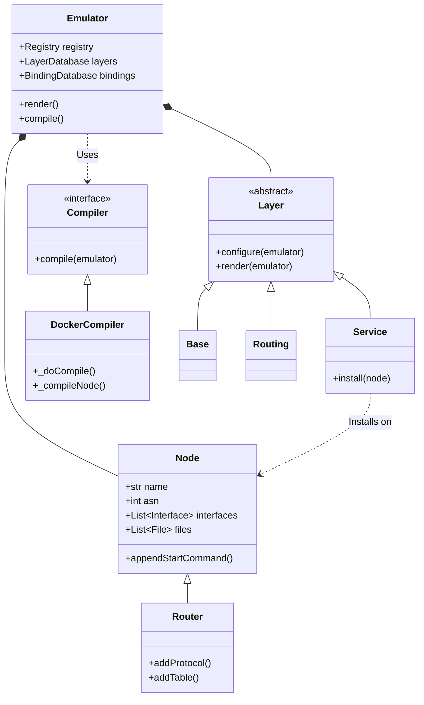
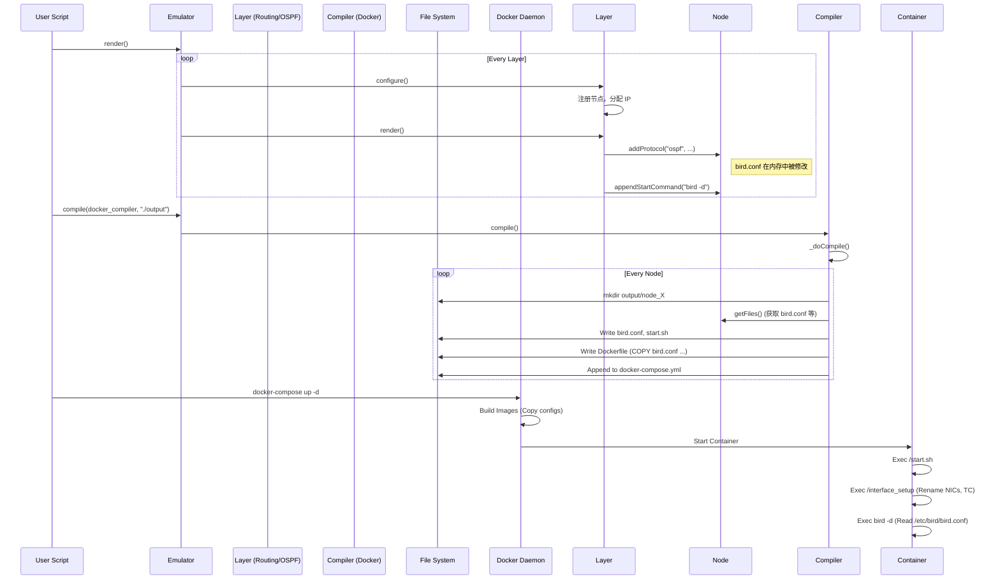

# SEED Emulator 技术白皮书：源码级深度逆向分析

## 1. 上帝视角 (Architecture Overview)

SEED Emulator 是一个典型的“定义-渲染-编译”架构的网络仿真框架。它将复杂的网络拓扑定义（Python 对象图）与底层的执行环境（Docker 容器编排）彻底解耦。

### 核心类架构

系统的核心由 `Emulator`（大脑）、`Layer`（功能分层）、`Service`（应用服务）和 `Node`（执行单元）构成。



### 目录结构解析

*   **大脑 (The Brain):** `seedemu/core/`
    *   `Emulator.py`: 总指挥。负责管理所有的层（Layers）和节点（Nodes），并调度渲染流程。
    *   `Node.py`: 容器的抽象表示。它不直接操作 Docker，而是存储“我需要运行什么命令”、“我有哪些文件”等元数据。
    *   `Layer.py`: 功能模块的基类。比如 `Ospf` 层负责给节点添加 OSPF 配置，`Base` 层负责创建基础网络。

*   **四肢 (The Limbs):** `seedemu/compiler/`
    *   `Docker.py`: 这是将 Python 对象转化为现实的关键。它读取 `Emulator` 中的数据，生成 `docker-compose.yml`、`Dockerfile` 和启动脚本。

---

## 2. 核心机制解密 (The Internals)

当用户在 Python 脚本中定义好网络拓扑后，Emulator 并非立即创建容器，而是经历了一个严密的转化过程。

### 从 Graph 到 Container

这一过程主要发生在 `seedemu/compiler/Docker.py` 的 `_doCompile` 方法中：

1.  **网络编译 (`_compileNet`)**:
    Compiler 遍历注册表中的 `Network` 对象，将其转化为 `docker-compose.yml` 中的 `networks` 定义。
    *   *自管理网络 (Self-Managed Network)*: 如果启用了 `selfManagedNetwork`，Compiler 会为网络分配一个“哑前缀”（Dummy Prefix，如 `10.128.0.0/9`），并在容器启动时通过脚本替换为真实的仿真 IP。这解决了 Docker IPAM 难以处理复杂 BGP/MPLS 网络的问题。

2.  **节点编译 (`_compileNode`)**:
    这是最复杂的部分。Compiler 为每个节点创建一个独立的目录（Build Context）。
    *   **Dockerfile 生成**: 调用 `_computeDockerfile`，基于节点的 `BaseSystem`（如 `seedemu-router`）生成 Dockerfile。它会自动注入 `RUN apt-get install` 来安装用户请求的软件。
    *   **文件系统映射**: `Node` 对象中存储的虚拟文件（如 `/etc/bird/bird.conf`）会被写入到宿主机的临时目录，并通过 Dockerfile 的 `COPY` 指令打入镜像。

### 网络层魔法 (Networking)

SEED Emulator 并不是直接调用 `ip link add`，而是利用 Docker 的网络驱动加上精妙的容器内脚本。

**底层 Linux 命令示例**:
当容器启动时，`seedemu/layers/Base.py` 注入的 `/interface_setup` 脚本会被执行。这个脚本读取 `/ifinfo.txt`（由 Compiler 生成的元数据），并执行如下操作：

```bash
# 重命名接口以匹配仿真拓扑（Docker 默认生成 eth0, eth1...）
ip link set eth0 down
ip link set eth0 name net0
ip link set net0 up

# 使用 TC (Traffic Control) 模拟网络延迟和丢包
tc qdisc add dev net0 root handle 1:0 tbf rate 100Mbit buffer 1000000 limit 1000
tc qdisc add dev net0 parent 1:0 handle 10: netem delay 10ms loss 0%
```

---

## 3. 协议栈注入 (BGP/OSPF)

SEED Emulator 的强大之处在于它能自动配置复杂的路由协议。这是通过“模板注入”实现的。

### 路由软件打包

在 `docker_images/seedemu-router/Dockerfile` 中，我们看到路由器的基础镜像安装了 `bird2`：

```dockerfile
FROM handsonsecurity/seedemu-base
RUN apt-get install -y --no-install-recommends bird2
```

### 配置文件生成 (Config Injection)

`bird.conf` 的生成是一个动态累加的过程，主要依赖 `seedemu/core/Node.py` 中的 `Router` 类。

1.  **初始化**: `Routing` 层 (`seedemu/layers/Routing.py`) 在 `configure` 阶段，会调用 `_configure_bird_router`，生成基础的 BIRD 配置（Kernel 协议、Device 协议）。

    ```python
    # seedemu/layers/Routing.py
    rnode.setFile("/etc/bird/bird.conf", RoutingFileTemplates["rnode_bird"].format(...))
    ```

2.  **协议注入**: 当 `Ospf` 或 `Ibgp` 层渲染时，它们会调用 `router.addProtocol()`。

    ```python
    # seedemu/core/Node.py
    def addProtocol(self, protocol, name, body):
        self.appendFile("/etc/bird/bird.conf",
            RouterFileTemplates["protocol"].format(...))
    ```

3.  **挂载**: 最终，`Compiler` 将内存中拼接好的 `bird.conf` 字符串写入宿主机的节点构建目录，并在 Dockerfile 中将其 `COPY` 到 `/etc/bird/bird.conf`。

---

## 4. 实战交互时序图

用户执行 `emu.compile(Docker(), "output")` 后的完整工作流如下：



---

## 5. 深度代码审计 (Code-Level Audit)

本章针对核心实现细节进行逐行级审计，解答关于 Docker 客户端初始化、底层网络命令生成及拓扑遍历的具体实现位置。

### 5.1 Docker Client 初始化

**核心发现**：
`seedemu` 的核心 Python 库（`seedemu/core` 和 `seedemu/compiler`）**并不直接调用** `docker.from_env()`。它采用了“编译器模式”，只负责生成静态配置文件（`docker-compose.yml`），具体的容器启动由用户在 Shell 中调用 `docker-compose up` 完成。

**哪里真正调用了 API？**
直接调用 Docker API 的代码主要存在于测试套件、示例代码以及配套的 Web 可视化工具中。

*   **Web 客户端后端**: 使用 Node.js 的 `dockerode` 库。
    *   **File Path**: `client/backend/src/utils/session-manager.ts`
    *   **Line 1**: `import dockerode from 'dockerode';`
*   **以太坊可视化后端**: 使用 Python 的 `docker` 库。
    *   **File Path**: `tools/Blockchain/EtherView/server/__init__.py`
    *   **Line 11**: `client = docker.from_env()`

### 5.2 网络命令生成 (String Concatenation)

虽然基础网络依赖 Docker Network Driver，但对于高级网络功能（如 EVPN/VXLAN），`seedemu` 会在 Python 代码中直接拼接 `ip link` 等 Shell 命令字符串。

**具体实现位置**：
*   **File Path**: `seedemu/layers/Evpn.py`
*   **Line 38-45**: `EvpnFileTemplates` 字典

**代码片段**:
```python
EvpnFileTemplates['vetp_bridge'] = '''\
auto br-{name}
iface br-{name} inet manual
    pre-up          ip link add br-{name} type bridge stp_state 0
    post-down       ip link del br-{name}

auto vtep-{name}
iface vtep-{name} inet manual
    pre-up          ip link add vtep-{name} type vxlan id {vni} dstport 4789 local {loopbackAddress}
    pre-up          ip link set vtep-{name} master br-{name}
    post-down       ip link del vtep-{name}
'''
```
**解释**：
这段 Python 字符串是一个 Debian 网络接口配置模板（`/etc/network/interfaces` 格式）。其中清晰可见：
*   `ip link add br-{name} type bridge`: 创建网桥。
*   `ip link add vtep-{name} type vxlan ...`: 创建 VXLAN 隧道接口。
这段字符串随后会被填充变量（如 `{vni}`），并通过 `setFile` 方法写入到容器内的 `/etc/network/interfaces.d/` 目录中，由容器启动时的 `ifup` 命令触发执行。

### 5.3 拓扑遍历 (Graph Traversal)

Emulator 将 Graph 对象转化为 Docker 容器的核心循环位于 `Docker` 编译器中。

**具体实现位置**：
*   **File Path**: `seedemu/compiler/Docker.py`
*   **Line Number**: ~1312 (在 `_doCompile` 方法内)

**代码片段审计**:
```python
    def _doCompile(self, emulator: Emulator):
        registry = emulator.getRegistry()

        # ... (Group Software Logic) ...

        # 第一遍遍历：创建网络 (First Pass: Networks)
        for ((scope, type, name), obj) in registry.getAll().items():
            if type == 'net':
                self._log('creating network: {}/{}...'.format(scope, name))
                self.__networks += self._compileNet(obj)

        # 第二遍遍历：创建节点 (Second Pass: Nodes)
        for ((scope, type, name), obj) in registry.getAll().items():
            if type == 'rnode':  # Router Node
                self._log('compiling router node {} for as{}...'.format(name, scope))
                self.__services += self._compileNode(obj)

            if type == 'csnode': # Control Service Node
                # ...
                self.__services += self._compileNode(obj)

            # ... 处理其他节点类型 (hnode, rs, snode) ...
```

**逻辑解析**：
1.  `registry.getAll()` 返回一个字典，包含了整个仿真拓扑的所有对象（节点、网络、服务等）。
2.  代码进行了两次遍历。第一次专门挑出 `type == 'net'` 的对象调用 `_compileNet`，生成 `docker-compose` 的 `networks` 部分。
3.  第二次遍历挑出各种类型的节点 (`rnode`, `hnode` 等)，调用 `_compileNode`，生成 `services` 部分和对应的 `Dockerfile`。
